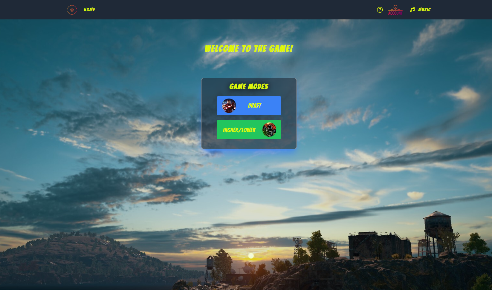

## Higher-Lower-Game

## Table of Contents

- [Description](#description)
- [Features](#features)
- [Statistics](#statistics)
- [Technologies-Used](#technologies-used)
- [Screenshot](#screenshot)
- [Contributing](#contributors)

## Description

Users will be able to create an account and choose between two game modes, Higher Lower and Draft Game. Stats will you be tracked and stored using MongoDB. These stats can be viewed within the user's profile!

- Higher Lower
  In the "Higher Lower" game mode, you will be presented with two heroes and their respective attribute values. Your task is to compare the attribute values and make a choice: is the attribute of the first hero higher or lower than the attribute of the second hero? Make your selection and see if you're correct. Your score will increase for each correct answer. How high can you go?

- Draft Game
  In the "Draft Game" mode, you will experience strategic team-building and turn-based battles. Here's how it works:

1. Start by drafting your team. You will be prompted with two heroes and their respective stats. Choose wisely, as you will need to build a team of five heroes.
2. Once your team is drafted, you will be matched against another player's team.
3. In each battle, you will choose an attack and the hero to execute it. Your goal is to reduce the opponent's team health to zero by making strategic choices.
4. Each hero has their unique stats and abilities, so choose your attacks carefully to maximize your chances of victory.
5. All wins and losses are recorded, so do your best to win them all!

## Features

- **Account Creation**: Users can create their own accounts, providing a personalized experience within the game.
- **Login System**: Secure login system ensures that users can access their accounts and game progress easily.
- **Two Game Modes**:
  - **Higher Lower**: Test your instincts and compare hero attributes to guess if they are higher or lower than their opponents.
  - **Draft Game**: Engage in strategic team-building by drafting heroes with unique stats and battling other teams in thrilling turn-based combat.
- **Persistent Statistics**: Game statistics, such as games played, wins, losses, and high scores, are stored using MongoDB for easy tracking and comparison.

## Statistics

This game tracks various statistics to keep you engaged and motivated. All of the stats are stored using MongoDB. Here are the statistics that are currently being tracked:

# Draft Game Statistics

Draft Games Played: Total number of draft games played.
Draft Game Wins: Number of victories achieved in draft games.
Draft Game Losses: Number of losses experienced in draft games.

# Higher Lower Game Statistics

Lower Higher Games Played: Total number of "Lower Higher" games played.
Lower Higher High Score: Highest score achieved in the "Lower Higher" game mode.

## Technologies Used

- React
- MongoDB
- Mongoose
- GraphQL
- Node.js
- Express.js
- JWT
- Heroku
- Tailwind

## Screenshot

## Contributors

- Julio Alvarez 
- David Peguero 
- Luis Robles 
- Trent Stanley 
- Dylan Yong 
